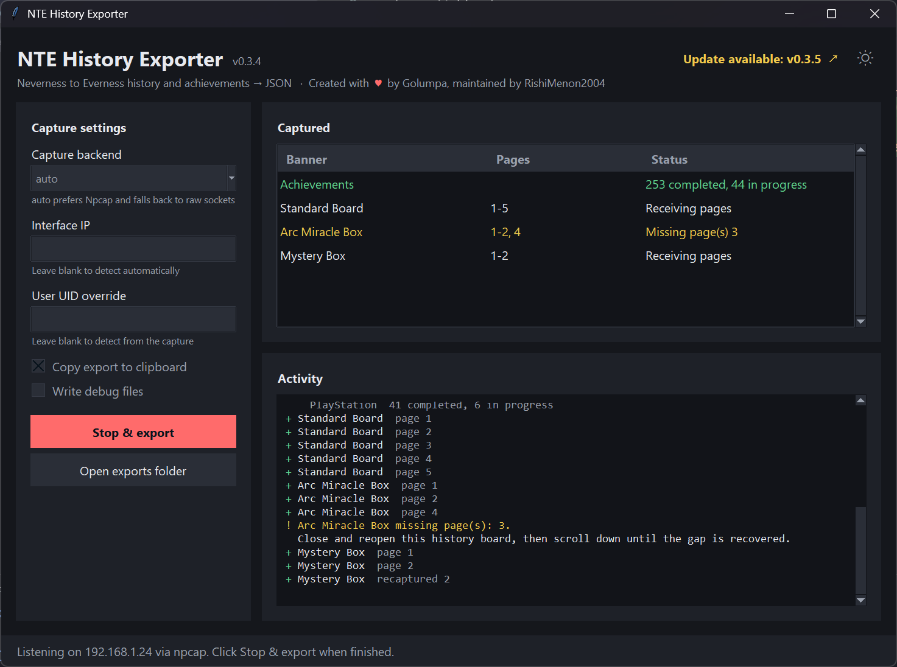

# Desktop GUI

The desktop GUI is a Tkinter window around the same live-capture code the CLI
uses. It needs nothing beyond the Python standard library.



## Running it

### Downloaded builds

Each [release](https://github.com/RishiMenon2004/nte-exporter/releases) has a
GUI build for every platform. Packet capture needs the same permissions as the
CLI, which is where the platforms differ.

**Windows**: `nte-history-exporter-gui.exe`

- Double-click it. With [Npcap](https://npcap.com/) installed, no
  Administrator rights are needed.
- Without Npcap, `auto` falls back to raw sockets, which need Administrator.
  Right-click the exe and choose **Run as administrator**.
- The exe isn't code-signed, so SmartScreen may warn on first launch. Choose
  **More info → Run anyway**.
- Exports are written to `exports\` next to the exe.

**Linux**: `nte-history-exporter-gui-linux`

```bash
chmod +x ./nte-history-exporter-gui-linux
```

Capture needs root or the raw-capture capabilities. Many desktops, and Wayland
in particular, refuse to show windows from apps run with `sudo`. So the
suggested route is to grant the capabilities to the binary once and then run it
as your normal user:

```bash
sudo setcap cap_net_raw,cap_net_admin=eip ./nte-history-exporter-gui-linux
./nte-history-exporter-gui-linux
```

This route hasn't been tested on every distribution yet. If it fails, run it
with `sudo -E ./nte-history-exporter-gui-linux` on an X11 session instead.
Exports go to `exports/` in the folder you started it from. If that folder
isn't writable, they go to `~/NTE History Exporter/exports/`.

**macOS**: `nte-history-exporter-gui-v<version>-x86_64-apple-darwin.zip`

- Unzip it and move **NTE History Exporter.app** to Applications.
- The app isn't signed or notarized, so the first launch is blocked. Right-click
  it, choose **Open**, then **Open** again. Alternatively, clear the quarantine
  flag:
  `xattr -dr com.apple.quarantine "/Applications/NTE History Exporter.app"`.
- Capturing needs access to the BPF devices. The simplest option is to start
  the app as root from Terminal:

  ```bash
  sudo "/Applications/NTE History Exporter.app/Contents/MacOS/nte-history-exporter-gui"
  ```

  To launch it by double-clicking instead, give your user BPF access. Wireshark's
  installer adds a **ChmodBPF** helper that does this.
- Exports go to `~/Documents/NTE History Exporter/exports/`. The
  **Open exports folder** button opens it.

The builds are x86_64. On Apple Silicon Macs the macOS build runs through
Rosetta 2.

### From source

| From | Command |
| ---- | ------- |
| Source checkout (Windows) | Double-click `run-exporter-gui.cmd` |
| Source checkout (any OS) | `PYTHONPATH=src python -m nte_history_exporter.gui` |
| Installed package | `nte-history-exporter-gui` |

From source, exports go to `exports/` under the working directory, the same as
the CLI. To build the packaged GUI yourself, see
[packaging.md](packaging.md#desktop-gui).

## How it fits together

```text
src/nte_history_exporter/gui/
  theme.py     colors, fonts, sizes, every string shown in the window   <- start here
  app.py       window layout, ttk styles, capture thread, event handlers
  reporter.py  GuiReporter: turns runner output into queue events
  __main__.py  `python -m nte_history_exporter.gui`
```

`run_live_capture()` in `live_capture/runner.py` takes two optional arguments
that the CLI leaves at their defaults:

- `reporter`: an object with the same functions as the `console` module
  (`print_page_captured`, `prompt_user_uid`, ...). The CLI passes `console`;
  the GUI passes a `GuiReporter`.
- `stop_requested`: a callable polled for every packet or read timeout. The CLI
  uses the press-any-key monitor; the GUI passes `stop_event.is_set`.

Capture runs on a background thread, and Tk widgets may only be touched from
the main thread. So `GuiReporter` never touches widgets: each call becomes an
event tuple such as `("page", "Standard Board", 3, False)` on a queue, and
`ExporterApp._drain_events` polls that queue every 50 ms and calls the handler
`_on_<event name>`. Prompts (missing UID/server) send a `PromptReply`; the
capture thread blocks on it until the dialog is answered.

## Customizing

Most changes only touch `theme.py`. To see a change, close and relaunch the
window; there is no hot reload.

### Colors

The sun/moon button in the header switches palettes while the app runs. Its
icons are set in `THEME_ICONS`: each is a list of `(font, glyph)` pairs, and the
first font installed on the machine is used. Windows gets Segoe Fluent Icons
(or Segoe MDL2 Assets on Windows 10). Elsewhere the fallback is a Unicode
☀/☾ in the body font. `THEME_ICON_SIZE` sets the size, and the hover tooltip
text is `TEXT["theme_to_light"]` / `TEXT["theme_to_dark"]`.

The choice is saved to `%APPDATA%\nte-history-exporter\gui.json`
(`~/.config/nte-history-exporter/gui.json` on Linux/macOS) and used on the next
launch. Delete that file to go back to the default.

The palette settings in `theme.py`:

```python
PALETTE = "dark"         # used on first launch, before the toggle is ever clicked
DARK_PALETTE = "dark"    # the toggle switches between these two
LIGHT_PALETTE = "light"
```

To make your own, copy one of the entries in `PALETTES`, give it a new name,
change the hex values, and point `DARK_PALETTE` or `LIGHT_PALETTE` at it (and
`PALETTE`, if it should be the first-launch default). Whatever `DARK_PALETTE`
names also gets a dark Windows title bar. If your saved choice no longer exists
in `PALETTES`, the app falls back to `PALETTE`. Every key must be present,
because `app.py` builds all the widget styles from these tokens:

| Token | Used for |
| ----- | -------- |
| `bg` | window background |
| `surface` | cards (sidebar, Captured, Activity), status bar, dialogs |
| `surface_alt` | secondary buttons, table headings, disabled inputs, scrollbar thumb |
| `field` | inputs, table body, activity log body, scrollbar trough |
| `border` | input borders, separators, hovered secondary button |
| `text` / `muted` | primary text / hints and secondary text |
| `accent` / `accent_hover` | Start button, focus rings, checked boxes, step numbers |
| `accent_text` | text on accent and danger buttons; pick for contrast against both |
| `success` / `warning` / `error` | log lines and table rows; `error` also colors the Stop button |
| `error_hover` | hovered Stop button |
| `select` | selected text and selected rows |

All color application lives in `ExporterApp._apply_palette`, which runs at
startup and on every toggle. ttk widgets pick up the new styles automatically.
Plain Tk widgets (the activity log, table row tags, the combobox dropdown, and
the title bar) are recolored there by hand. If you add a plain `tk` widget, or
color something outside `_configure_styles`, recolor it in `_apply_palette` too,
or it will keep the old palette after a toggle.

### Fonts

`FONTS` maps a role to a Tk font tuple `(family, size, optional style)`, and
`FONT_FAMILY` / `MONO_FAMILY` are picked per platform. For example:

```python
FONTS["title"] = ("Bahnschrift", 20, "bold")
FONTS["log"] = ("Cascadia Mono", 10)
```

If a family isn't installed, Tk silently falls back to a default font. To list
the families available on a machine:

```python
import tkinter, tkinter.font
tkinter.Tk(); print(sorted(tkinter.font.families()))
```

### Sizes and spacing

`WINDOW` (initial and minimum size) and `LAYOUT` (padding, gaps, sidebar text
wrap width, table row height) are in pixels **at 100% display scaling**.
`ExporterApp.px()` multiplies them by the OS scale factor, so at 150% scaling
`padding: 16` becomes 24 px. Font sizes are in points and Tk scales those itself.

If you add text to the sidebar, raise `WINDOW["min_size"]` so the sidebar can't
be squeezed until its buttons are cut off.

### Text

Every string the window shows is in `TEXT`: labels, hints, button captions,
status-bar messages, dialog prompts, and the "How to capture" steps shown in
the Activity panel while idle (`TEXT["instructions"]`, one entry per step).
Some strings take placeholders, such as `{ip}`, `{backend}`, `{count}`,
`{version}` and `{game}`. Keep those when you reword them.

The results notes written after a capture (for example "No history pages were
captured.") come from `runner.py` and are shared with the CLI, so change them
there.

### Activity log colors

`LOG_COLORS` maps a log tag to a palette token. To add a style, add a tag here
and use it in `app.py`:

```python
# theme.py
LOG_COLORS["highlight"] = "accent"

# app.py, inside any handler
self._append(("Nice pull!", "highlight"))
```

`_append` takes any number of `(text, tag)` segments and writes them as one
line, which is how a single log line gets several colors.

## Going further (app.py)

### Restyling a widget type

All ttk styling happens in `ExporterApp._configure_styles`, which uses the
built-in `clam` theme because it respects custom colors on every platform
(the native Windows theme ignores most of them). Style names follow ttk's
`Variant.Base` convention: `Accent.TButton` inherits from `TButton`, and
`Hint.Card.TLabel` inherits from `Card.TLabel`. To add a variant:

```python
style.configure("Ghost.TButton", background=c["surface"], foreground=c["accent"])
style.map("Ghost.TButton", background=[("active", c["surface_alt"])])
...
ttk.Button(card, text="Help", style="Ghost.TButton", command=...)
```

`configure` sets the normal look and `map` sets per-state overrides
(`active` = hovered, `pressed`, `disabled`, `selected`, `focus`). If a widget
shows an unexpected light-grey patch, it is usually a clam default for a state
you haven't mapped. For example, scrollbars use the `disabled` state when
there is nothing to scroll. Check the defaults with
`ttk.Style().map("TScrollbar")`.

### Moving things around

Layout is split into `_build_sidebar`, `_build_captured` and `_build_activity`,
which `_build_layout` arranges in a grid. Each returns a card frame:

- Swap `column=0` and `column=1` in `_build_layout` to put the sidebar on the right.
- Change `main.rowconfigure(0, weight=2)` / `(1, weight=3)` to change how
  space is split between the Captured table and the Activity log.
- Add a setting by creating a `tk.StringVar`/`BooleanVar` in `__init__`,
  adding the widget in `_build_sidebar`, listing it in `self.setting_widgets`
  (so it is disabled during capture), and passing its value in the
  `options` dict in `_start_capture`.

### Reacting to a new kind of event

1. Add a method to `GuiReporter` that calls `self._emit("my_event", ...)`.
2. Add `_on_my_event(self, ...)` to `ExporterApp`.

If the runner should call it, add the same function to `console.py` too, so
the CLI keeps working with the default reporter. `tests/test_gui.py` shows how
to drive `run_live_capture` with a fake capture backend and check the events.

### Previewing without the game

You don't need live traffic to iterate on the look. Put events on the queue
yourself:

```python
import tkinter as tk
from nte_history_exporter.gui.app import ExporterApp

root = tk.Tk()
app = ExporterApp(root)
app.events.put(("listening", "192.0.2.10", "npcap", ""))
for page in range(1, 6):
    app.events.put(("page", "Standard Board", page, False))
app.events.put(("missing", "Arc Miracle Box", [3]))
app.events.put(("achievements", 212, 38, 41, 6))
root.mainloop()
```

Run it with `PYTHONPATH=src`.
